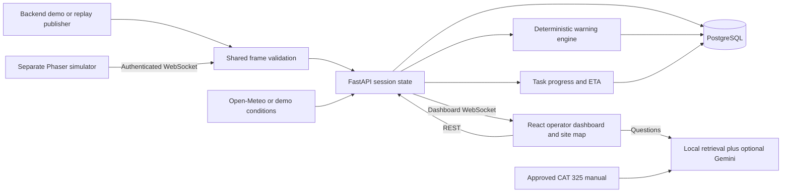

# Architecture baseline — v1 scaffold

This is the selected implementation baseline, not an implemented system. Changes go through a coordinated contract ticket.

## One modular backend, two independent browser apps

Backend modules: auth, operators, machines, sessions, ingestion, demo, sites, safety, incidents, tasks, analytics, training, assistant, weather. These are packages within **one FastAPI process**, not services. ML routines live in ml/ and are invoked through backend adapters; no separate ML server. Voice is a future adapter.

## Technology choices

See [docs/tech-stack.md](docs/tech-stack.md). React/TypeScript/Vite for the dashboard; Leaflet CRS.Simple for the custom map; Phaser 3/TypeScript/Vite for the later simulator; Python 3.12/FastAPI/Pydantic; PostgreSQL 17 with SQLAlchemy/Alembic; scikit-learn for ETA/anomaly models; server-side Google GenAI SDK for Gemini. Use local TF-IDF retrieval over page-aware manual chunks first; no vector database/service is necessary at this scale.

Only contract/build-validation dependencies are installed in the scaffold. Add runtime packages in implementation issues and commit updated locks. Python runtime packages are declared in backend/pyproject.toml for planning, but there is no runnable module.

## State authority and source handoff

The backend owns authenticated operator identity, active sessions, source selection, task status/progress, environment settings, safety evaluations and persisted history. Exactly one publisher owns a session: backend demo/replay or simulator. Frame sequence numbers are monotonic per session. Replace the source by ending the old session and starting a new one; never combine streams into one session.

A frame includes telemetry, attachment pose, world actors and work events from the same simulation tick. This avoids map/proximity checks using actors from a different tick. The server validates and broadcasts that same frame, along with separately computed alerts/insights/task updates. Initial connection and reconnection receive a full snapshot before live updates.

## Time and units

Wire timestamps: RFC3339 UTC ending Z. Runtime wall-clock timestamp is separate from simulation_time_s (pauseable elapsed simulation seconds). v1 runs at 1x time; accelerated replay requires a later documented clock policy. Use SI units except explicitly named hydraulic_pressure_psi. Positions use site-local meters: origin southwest, +x east, +y north, heading 0 north/90 east. Renderers transform y for canvas as necessary. Leaflet uses [y_m, x_m]. Never treat site coordinates as latitude/longitude.

## Auth and persistence

Opaque server-side sessions with Argon2 password hashes, HttpOnly SameSite=Lax cookies and CSRF tokens on state-changing REST calls. Cookies are Secure in HTTPS deployments; local HTTP is explicitly development-only. Store session-token hashes, not raw tokens. No JWT/localStorage requirement. See docs/api.md and docs/database.md for ownership and authentication details.

Store derived incidents/tasks/history transactionally. Keep the latest live state in memory per active session. Broadcast at 5 Hz; persist telemetry at 1 Hz plus event-triggered samples. All work events/incident transitions are durable regardless of sample downsampling. Those rates are demo defaults, not accuracy claims. One backend worker owns in-memory sessions in v1; scaling requires an explicit design change.

## Safety, models and assistant

Safety rules are deterministic and warnings only; thresholds are versioned demo configuration, not claimed OEM limits. The assistant may explain facts, never determine alert severity or actuate machinery. ETA predicts actual_minutes using only information available before/during a task; it cannot use actual completion time as input. Demonstrate model performance only on held-out synthetic data and disclose that limitation. Page-grounded Q&A abstains when evidence is missing. See docs/safety.md, docs/data.md and knowledge/README.md.

## Local development

Ports: dashboard 5173, simulator 5174, backend 8000, PostgreSQL 5432. Vite proxies /api and /ws to the backend so browser cookies work without token-in-URL hacks. Production hosting is not configured. Live weather uses a separately configured site latitude/longitude; the synthetic map does not move when weather location changes.
